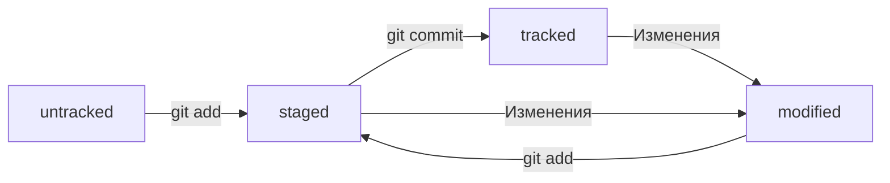

# Основные этапы работы с Git
## Командная строка
### Основные команды
```bash
$ pwd # узнать директорию, в которой находишься

$ cd # перейти в директорию

$ cd ~ # перейти в домашнюю директорию

$ cd .. # переходим на уровень выше

$ ls # вывести список содержимого директории

$ ls -a # + скрытое содержимое
```
### Операция с папками и файлами
```bash
$ touch my-new-file.txt # создали файл my-new-file.txt 

$ mkdir new-dir # создали директорию new-dir 

$ mkdir -p dir1/dir-inside/dir-deeper-inside # создание структуры директорий

$ cp index.html src/
# скопировали index.html в папку src 

$ mv table.csv ./very-important-files
# перемещение файлов

$ cat myfile.txt # распечатать содержимое файла myfile.txt

$ rm example.txt # удаление файла

$ rm -rf images # удалить папку со всем её содержимым
```
## Начало работы с Git
### Идентификация
Перед начало работы необходимо идентифицировать пользователя
```bash
$ git config --global user.name "User Namovich" 
# имя или ник нужно написать латиницей и в кавычках

$ git config --global user.email username@yandex.ru
# здесь нужно указать свой настоящий email 

$ git config --list # текущие значения пользователя
```
### Инициализация репозитория
Создать репозиторий можно в любой папке. Нежелательно создавать вложенные репозитории
```bash
$ git init # создать репозиторий в текущей директории

$ rm -rf .git # "разгитить" папку

$ git status # вывести статус репозитория
```
Команда `git status` выведет:
* название текущей ветки: `On branch master` или `On branch main`;
* сообщение о том, что в репозитории ещё нет коммитов: `No commits yet`;
* сообщение, которое говорит: «чтобы что-нибудь закоммитить (то есть зафиксировать), нужно сначала это создать» — `nothing to commit (create/copy files and use "git add" to track)`.
### Добавление файлов в репозиторий
```bash
$ git add --all # подготовили к сохранению все файлы в репозитории

$ git add todo.txt # для отдельных файлов
```
### Коммит
```bash
$ git commit -m 'Мой первый коммит!' # Сохранить изменения с комментарием (-m)

$ git log # Вывести историю коммитов
```
Команда `git commit` выведет информацию о коммите.
`[master (root-commit) baa3b6e]` значит:
коммит был в ветке `master`;
`root-commit` — это самый первый коммит в ветке
`baa3b6e` — сокращённый идентификатор коммита
## Создание SSH-ключа
1. Для генерации SSH-пары можно использовать программу ssh-keygen. Откройте терминал и введите следующую команду.
```bash
$ ssh-keygen -t ed25519 -C "электронная почта, к которой привязан ваш аккаунт на GitHub"
```
Если выдаётся ошибка, использовать другой алгоритм:
```bash
$ ssh-keygen -t rsa -b 4096 -C "электронная почта, к которой привязан ваш аккаунт на GitHub"
```
2. Укажите место хранения ключей. Простой вариант — сделать домашний каталог пользователя путём по умолчанию. Для этого нажмите Enter.
```bash
> Enter a file in which to save the key (C:\Users\<имя_пользователя>\.ssh\):[Press enter]
```
3. Проверить, что ключи сгенерировались.
```bash
ls -a ~/.ssh
```
[Видео по генерации SSH](https://disk.yandex.ru/i/Jpg6qIw_DzgwrQ)
## Связывание локального и удаленного репозитория
Для связывания необходимо использовать адрес удаленного репозитория в следующей команде:
```bash
$ git remote add origin git@github.com:%ИМЯ_АККАУНТА%/first-project.git 
```
Проверить связанность репозиториев:
```bash
$ git remote -v
```
Для отправки изменений на удаленный репозиторий:
```bash
$ git push -u origin main # Первый раз (вместо main может быть master)
$ git push # Последующие разы
```
## Статусы файлов в Git

## Файл `HEAD`
Файл `HEAD` один из служебных файлов папки `.git`. Он указывает на коммит, который сделан последним.

Внутри `HEAD` — ссылка на служебный файл: `refs/heads/master`. В файле, можно увидеть хеш последнего коммита.

При коммите, Git обновляет `refs/heads/master` — записывает в него хеш последнего коммита. Получается, что `HEAD` тоже обновляется, так как ссылается на `refs/heads/master`.

